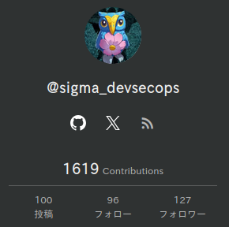

# ネット上のたくさんの誰かのおかげで エンジニアになれた話と Qiitaを書くようになって得た知見の共有 2025/04/14 Qiita Bash @sigma_devsecops

---

# 自己紹介

- 名前: sigma
- 職業: セキュリティエンジニア
  - \#春から四年目
  - セキュリティ診断
  - SI開発/保守
- Qiita: [@sigma_devsecops](https://qiita.com/sigma_devsecops)↓

---

# 今日お話すること

- 自分がエンジニアになるまで
  - 過去に助けられたと思う記事を紹介して感謝を伝えたい
- 自分も記事を書くようになって得た知見の共有
  - 失敗したこととその改善策
  - Qiitaを書く際に自分が工夫していること

アウトプットすることに抵抗がある方や，うまくアウトプットできない方に少しでも参考になれば嬉しいです

---

# エンジニアになるまで

- もともと理学部の地学をやっていた
- Steins;Gate に影響されて興味を持つ
- 2018年秋頃のFortranでHello, World!
- 2021年の就活でセキュリティエンジニアに絞って就活
- 2022年4月からセキュリティエンジニアに

---

# エンジニアになるにあたって自分に影響を与えた記事の紹介

---

# 最初の一歩を踏み出すのに役に立った記事

- [仕事の役には立たない，Linuxにおけるジョークプログラムの話](https://qiita.com/Hiroki_lzh/items/8cf206d54f91e29b3912) @Hiroki_lzh
- [お前らのターミナルはダサい](https://qiita.com/kinchiki/items/57e9391128d07819c321) @kinchiki
- [新しいLinuxの教科書](https://www.sbcr.jp/product/4815624316/)(本)
- [誰でもできるようになる，やさしいVim入門](https://qiita.com/5t111111/items/d28e50f70f81d3d36c30) @5t111111
- [Vim 設定ガイド](https://qiita.com/marrontan619/items/541a1374e1ac672977e6) @marrontan619
- [dotfilesの育て方](https://qiita.com/reireias/items/b33b5c824a56dc89e1f7) @reireias

CLIを使うのが人よりも得意になったように思う

---

# 道を示してくれた記事

[How to be a Hacker](https://cruel.org/freeware/hacker.html)
> ハッカーは問題を解決し、物事を築きます。そして自由と自発的な助け合いを信条としています。

> ハッカーらしくふるまうには、他のハッカーたちが考える時間は貴重であると信じなければなりません。それをとことん信じて、情報を共有するのがほとんど道徳的な義務であると思えるようになりましょう。

> ハッカー社会での最も神格的な英雄は、大規模で役に立つプログラムを書き、それが広範なニーズに応えていて、しかもそれを無償でばらまいてくれて、だからみんながいまやその人の書いたソフトを使うようになっている、そんな人です。

自分のエンジニア人生のベースとなる考え方を教えてくれた記事

---

# Qiitaを書き始めた

2024年4月からQiitaを書き始めた
いろいろ模索中

---

# なぜQiitaを書こうと思ったのか

- ローカルのメモよりも強制力が働く
  - ちゃんと調べる
  - 早く成果を出せる
- 人に伝える力がつく
  - AIとの差別化を考えたい
- 勉強会で友達を作るなら有名なほうが良いはず

---

# Qiitaを書くなかでの失敗を振り返る

- 情報だけを書いてしまった
- 量を意識した結果，質が落ちた
- 流行りにとびつきすぎてしまった

---

# 情報だけを書いてしまった

## 失敗例

- 後で見返しても自分にとって役立つ情報が少ない記事になっていた
- 結論しか書いていない→AIで調べたほうが良い
- かっこつけて失敗を晒さない

## 改善施策

読む人のことを考えて記事を書く必要がある

- 導入部分を丁寧に書く
- 誰をターゲットにするのかを意識して，適切に用語の解説等をいれる
- 自分の失敗したところや詰まったところを重点的に書く

---

# 量を意識した結果，質が落ちた

## 失敗例

アドベントカレンダー完走を目標にした結果，謎記事を書いてしまった

## 改善施策

- 来年のアドベントカレンダーは少し書き溜めてみる
- 記事を書くこと自体を目的にしない

---

# 流行りにとびつきすぎてしまった

## 失敗例

- Twitterで流れてくる新しい情報を追いかけすぎてしまう
- 情報が出てからのスピードだけで勝負してしまい，深堀ができていない
→結果として，ナレッジの収集に時間をかけすぎている状態に

## 改善施策

- やりたいことリストを作成し，自分の守備範囲をある程度可視化しておく
- 自分の過去記事を分類してみる
→あちこち手を出しすぎていることが自覚でき，不必要に流行りに飛びつかなくなった

---

# Qiitaを書く際に自分が工夫していること

- **AI丸コピはしない**
- 1記事1テーマの原則
  - 長い記事は分割
  - 伝えたいことやターゲットを明確にする
- なるべく間違えたことを書かない
  - 事実と意見をわけて書く
  - 情報の出所を明記する
  - なるべく公式ドキュメントを引用する
  - AIに文法や内容を見てもらう(何もしないよりはマシ)
- 結局KPTを回すのが大事。準備に時間をかけすぎない

---

# ご清聴ありがとうございました

(↓AIのアドバイスにより再度表示させていただきます)

Qiita: [@sigma_devsecops](https://qiita.com/sigma_devsecops)

