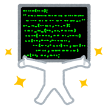

# ネット上のたくさんの誰かのおかげで エンジニアになれた話と今後

---

# 自己紹介

- 名前: 富田 涼介, Tommy
- 職業: セキュリティエンジニア
  - \#春から四年目
  - セキュリティ診断
  - SI開発/保守
- Qiita: [@sigma_devsecops](https://qiita.com/sigma_devsecops)↓

---

# 巨人の肩の上に立つ

---

# 目次

- なぜ，エンジニアになろうと思ったのか
- 巨人(記事)に助けられた話
- 巨人側になるには
  - 記事を書くことで他者視点が得られる
  - Qiitaを書くこと木に気をつけていることなど

---

# なぜ，エンジニアになろうと思ったのか

- 2019年秋頃からSteings; Gateに影響されて
- 研究データの解析でPythonを書いていて，こっちの方が楽しくなった

---

# 道を示してくれた記事

- [ハッカーになるには何を覚え，どのような勉強をすればよいのか?おすすめの本を紹介](https://eigo-shutoku.com/how-to-be-a-hacker/)
- [How to be a Hacker](https://cruel.org/freeware/hacker.html)
- [2020年の開発者が知っておくべき11の必須スキル](https://qiita.com/rana_kualu/items/c79a16ff503c86b27483) @rana_kualu

---

# LinuxやVimが好きになるきっかけ

- [仕事の役には立たない，Linuxにおけるジョークプログラムの話](https://qiita.com/Hiroki_lzh/items/8cf206d54f91e29b3912) @Hiroki_lzh
- [お前らのターミナルはダサい](https://qiita.com/kinchiki/items/57e9391128d07819c321) @kinchiki
- [新しいLinuxの教科書](https://www.sbcr.jp/product/4815624316/)(本)
- [誰でもできるようになる，やさしいVim入門](https://qiita.com/5t111111/items/d28e50f70f81d3d36c30) @5t111111
- [Vim 設定ガイド](https://qiita.com/marrontan619/items/541a1374e1ac672977e6) @marrontan619

---

# 未経験からエンジニアになれた理由を考察してみる

**先人のアウトプットのおかげ**

- 記事を読む過程で，頻出用語の意味がなんとなく学べていた
- Vimだったり，Linuxの知識が多少ついていたので，知識が薄っぺらく見られなかった(やる気ありそうに見えた)

---

# 次は自分も巨人側へ

(2024年4月から本格的にアウトプットを始めた駆け出しです)

---

# アウトプットすることのメリット

- 自分の知識の整理
- モチベーションの維持
- 少し自身がつく/技術力が見える化される
- **他者視点を持つ，伝える力のトレーニングに**

---

# 他者視点を持つことの難しさ「ggrks」文化の弊害

- ❌自分は苦労したので他人も苦労すべき
- ❌自分が当たり前にできることは他の人もできるはず

→AI時代の敗北者

---

# 他者視点を持つことの必要性

- 人/AIにうまく情報を伝えるには他者視点が重要
- 誤解なく人と人がわかり合える**「AI時代のニュータイプ」**を目指そう
- 苦手な人は，記事を書くことから始めるのが良いのでは?

---

# まず，Qiitaより始めよ

- 低ハードル
  - 他ブログサイトよりも敷居が低い気がする
  - LTなどと違って時間の制約なし
- 「いいね」がつくことで他者からのフィードバックが得られる
- 検索で上位に出やすい気がする/認知度が高い

---

# Qiitaを書く際に自分が気をつけていること

- **AI丸コピはしない**
- 気楽にやる
  - 数字を狙いすぎない
  - 1記事1テーマの原則
  - 簡単なことでも必要な人はいる
  - 怒られても気にしすぎない。素直な気持ちで
- なるべく間違った理解を広めないようにする
  - 事実と意見をわける
  - 情報の出所を明記する/なるべく公式ドキュメントを引用する
  - AIにファクトチェックしてもらう

---

# まとめ

- 未経験からエンジニアになるにあたってネットの記事がすごく助けになった。圧倒的感謝!
- 発信する側になると人に伝える力が鍛えられる。みんなで頑張ろう
- 発信するならQiitaからスタートがいいんじゃなかろうか(偏見かも)
- 何事も経験。やってみた先に何かがあるはず
