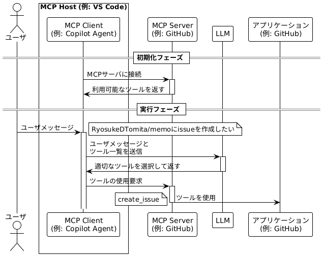

<center>

#### MCPで広がる生成AI活用の可能性!  2025/07/02 Qiita Bash

</center>

# MCPのセキュリティ

<!-- iconを絶対配置することで文字の位置がずれる現象を防ぐ -->
<style>
.icon-absolute {
  position: absolute;
  right: 20px;
  z-index: 10;
}
</style>

<div class="icon-absolute">


</div>

<center>Ryosuke Tomita(sigma)</center>

---

## MCPとは

- MCP(Model Context Protocol)は，アプリケーションがLLMにコンテキストを提供するためのオープンプロトコル

- MCPにより，AI AgentがLLMと接続するAPIが統一化され，データソースやツールとの連携が容易になる

- リモートMCPサーバとローカルMCPサーバの2種類がある

---

## MCPはどうやってツールを使用しているのか



---

## MCPではJSON-RPCを使ってやり取りする

```json
{
  "jsonrpc": "2.0",
  "method": "profile",
  "params": ["富田涼介"],
  "id": 1
}

```

```json
{
  "jsonrpc": "2.0",
  "result": {
    "年齢": 27,
    "所属": "NRI→NRIセキュアに出向(2022/04~)",
    "業務内容": "認証基盤のSI開発/保守，脆弱性診断，シフトレフト活動",
  }
  "id": 1
}
```

---

## MCPのセキュリティリスク

- MCPサーバ自体に悪意がある場合

- MCPサーバの実装に脆弱性がある場合
  - 入力値のサニタイズ
    - プロンプトインジェクション(MCP)
    - OSコマンドインジェクション
  - アクセス制御
    - 接続元制御
    - OAuth
  - タイポミス
  - EDoS

---

## リモートMCPサーバの接続先のタイプミスを狙った攻撃

- ブラウザの場合は，怪しいドメインへ接続しようとするとリダイレクトされる。例: gogle.comはwww.google.comにリダイレクトされる
- リモートMCPサーバのurlは設定ファイルに記載するため，MCPクライアントの実装によっては，URLのタイプミスで攻撃社の運営するサイトに接続するおそれがある。

```json
  "mcp": {
    "servers": {
      "github": {
        "type": "http",
        "url": "https://api.githubcopilot.com/mcp/"
      },
```

- 対策: 手打ちしない。whois情報などを確認する。

---

---

## まとめ

- リモートMCPサーバを使用する際には運営元を確認する。
- ソースが確認できるならチェックする。

---

## Thanks

<style> .icon-absolute {
  position: absolute;
  right: 20px;
  z-index: 10;
}
</style>

<div class="icon-absolute">


</div>
<!--QR画像を横並びにする-->
<div style="display: flex; justify-content: center; align-items: center; gap: 2em; margin-top: 2em;">
  
  
  
</div>

※発言はすべて個人の見解であり，所属組織を代表するものではありません
